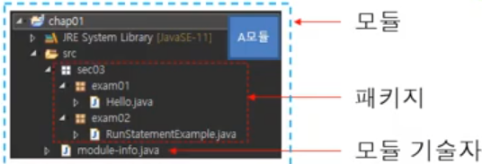

## 모듈이란?

- 외부에서 재사용할 수 있는 패키지를 묶은 것
- 이클립스의 프로젝트는 하난의 모듈을 개발하는 것을 의미

## module-info.java (모듈 기술자)

- 해당 모듈에 대한 이름
- 해당 모듈의 의존하는 모듈이 무엇인지 설명
  - 의존하는 모듈 : 해당 모듈을 실행하기 위해 필요한 외부 모듈
- 해당 모듈을 외부에서 사용하는 방법

## 모듈화가 필요한 이유

- 패키지 보안
- 작은 최적의 런타임 이미지를 만들기 위해

## 자바 코드 구성

- 패키지
- 클래스
- 메소드
